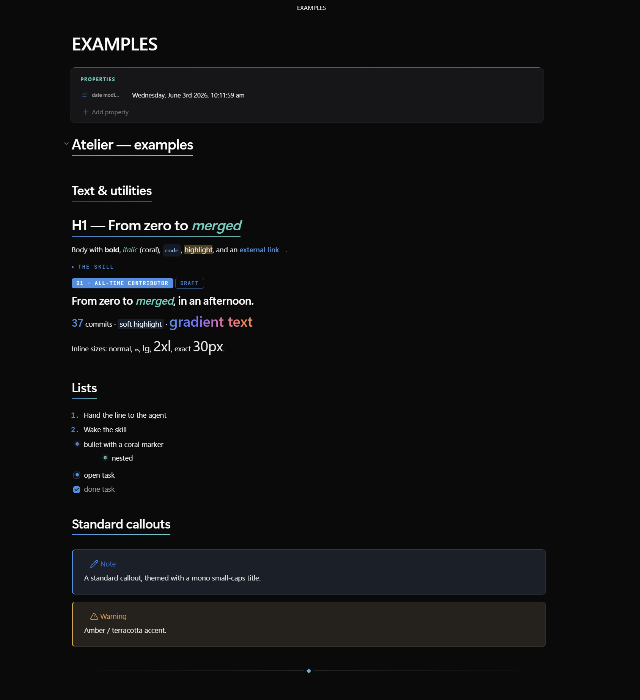

# Aurora

A clean, **Apple-style frosted-glass** Obsidian theme — translucent cards with real backdrop blur, a calm
**blue accent** with **teal italics**, and crisp **Segoe UI** typography. Dark-first with a bright light
variant. Everything resolves through `--mwg-*` design tokens, so a single accent picker recolours the
whole theme.

Its signature is a **webpage-like card system** you compose in plain Markdown, plus reusable text
utilities so any run of text can be restyled inline — including an **Apple-style gradient text** class.

> **Companion theme:** [Atelier](https://github.com/bsbbera/atelier-obsidian) shares the *same* card /
> column / utility syntax. A note authored for one renders with identical layout in the other — only the
> skin (warm paper + coral + serif) changes.



---

## Install

**From Obsidian (once published):** Settings → Appearance → Themes → **Manage** → search **Aurora**.

**Manually:** copy `manifest.json` + `theme.css` into `<vault>/.obsidian/themes/Aurora/`, then pick
**Aurora** under Settings → Appearance.

> Requires Obsidian 1.5.0+. Install the **Style Settings** plugin to customise colours, fonts, sizes, the
> default-style dropdowns, the gradient ramp, and the glass blur. Aurora's defaults use **system fonts
> (Segoe UI)**, so it works offline out of the box.

---

## Tutorial

### 1. Cards — a layout + a style
Wrap any number of cards in `> [!grid]`; they flow into as many columns as fit and reflow on resize.

```md
> [!grid]
> > [!card] One
> > [!card] Two
> > [!card] Three
```
- Lock columns: `> [!grid|cols2]` … `cols6`.  · Span: `span2`, `span3`, `spanfull`.  · Grids nest.

> **Nesting rule:** child cards use `>>` and must be separated by a blank `>` line.

Pick a card **style** with `> [!card|<style>]` (bare `[!card]` follows the *Default card style* dropdown):

| Style | Look |
|---|---|
| `skill` | label, big title, dark command bar, blue `01 02 03` steps |
| `section` | flat column block — `###### I · LABEL` (use in `cols3`) |
| `step` | ringed icon + `###### Step 0N` (use inside a `hero`) |
| `profile` | centered avatar, label, name, link |
| `honor` | dark — rank badge, ringed avatar, pull-quote, big stats |
| `channels` | dark — table of `#channel \| LABEL` rows |
| `hero` | big display heading + buttons; add `split` for a side-by-side hero |

**Surfaces:** add `dark` or `accent`. **Buttons:** `**[Label](url)**` → filled, `[Label](url)` → outline.
**Emphasis:** `*italic*` words render in the teal emphasis colour.

Frosted glass (translucency + backdrop blur) is applied to light/default cards & infoboxes; dark
honor/CTA surfaces stay solid for legibility.

### 2. Multi-column notes — `[!columns]` + `[!col|wN]`
```md
> [!columns|ruled]
> > [!col|w3]
> > ### Narrow
> > [!col|w7]
> > ### Wide
```
Weights `w1…w10`; add `ruled` for dividers.

### 3. Infobox — `[!infobox|right]`
A wiki-style frosted text infobox that floats `left`/`right`/`center` with text wrapping beside it.

### 4. Reusable text utilities (inline HTML)
`at-kicker` · `at-badge`(`.ghost`) · `at-display` · `at-lead` · `at-stat` · `at-mark` ·
**`at-gradient`** (Apple-style gradient text — override the ramp per use with `style="--grad: …"`, or set
the stops in Style Settings).

**Inline font size:** `at-xs … at-4xl`, or exact `at-fs` + `style="--fs: 30px"`. They **compose** —
e.g. `class="at-gradient at-2xl"`.

### 5. Tags, headings, body size
Category-tinted tags; per-heading `#center`/`#right`/`#left`; per-note body size via `cssclasses:
[text-lg]` or the Style Settings slider.

See **[EXAMPLES.md](EXAMPLES.md)** for a ready-to-paste note exercising every feature.

---

## Customising
**Settings → Style Settings → Aurora** — accent & colours, **italic/emphasis colour**, **font dropdowns**,
note width, roundness, default card style, **card glass blur**, **gradient ramp (4 stops + angle)**, body
size, and animations.

## Credits
- Fonts: Segoe UI (system); JetBrains Mono for code.
- License: [MIT](LICENSE).
